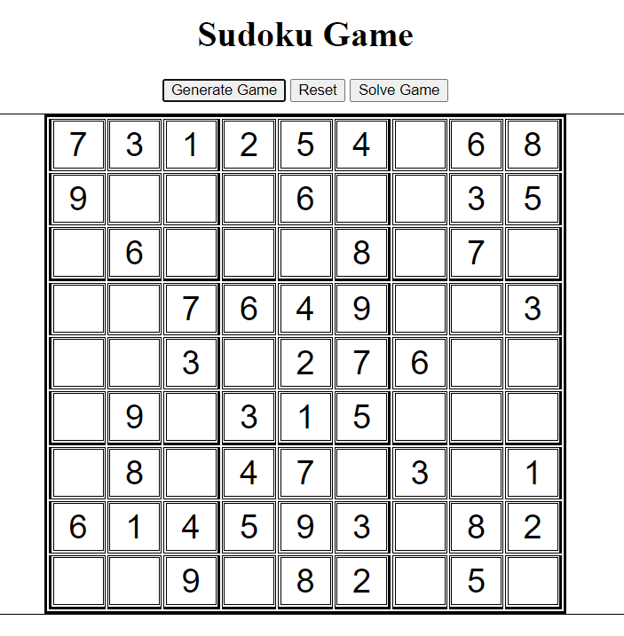
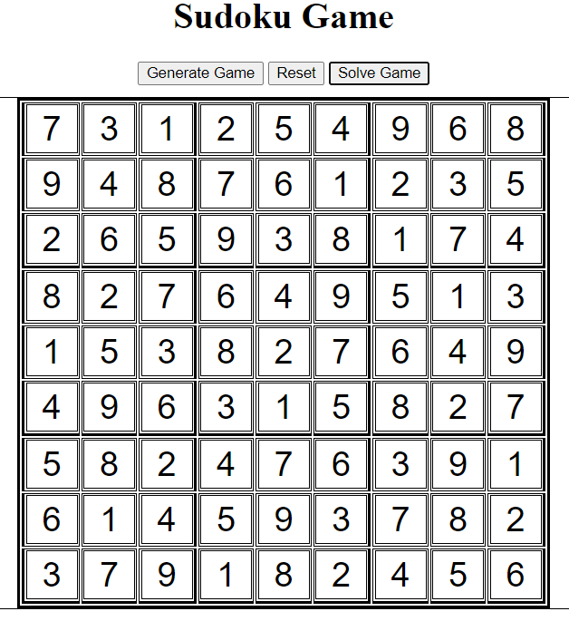

# Sudoku Solver Web App
This web application allows you to generate and solve Sudoku puzzles online.

  

  <i>Image of unsolved Sudoku grid</i>

 
 

  

  <i>Image of solved Sudoku grid</i>

## Features
**Sudoku Generator:** Click the "Generate" button to generate a new Sudoku puzzle. The app creates a unique puzzle each time based on predefined rules.

**Sudoku Solver:** Use the "Solve" button to automatically solve the currently displayed Sudoku puzzle. The solver employs an efficient algorithm to find the solution.

**Clear Grid:** If you want to start fresh, simply click the "Clear" button to clear the entire Sudoku grid and reset the puzzle.

## Technologies Used
* HTML
* CSS
* JavaScript

## Contributing
Contributions are welcome! If you encounter any issues or have suggestions for improvements, please open an issue or submit a pull request.
